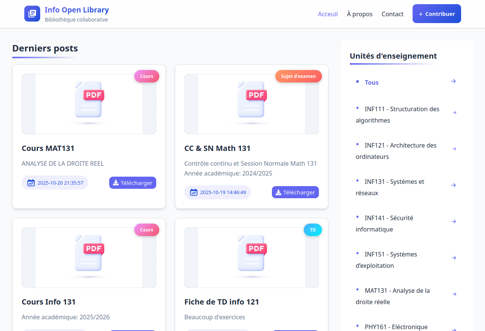
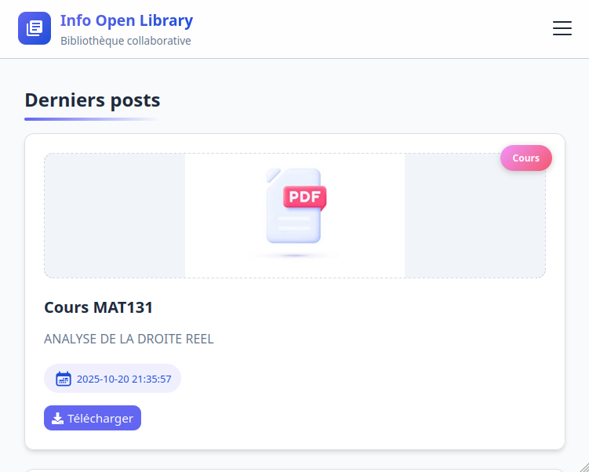
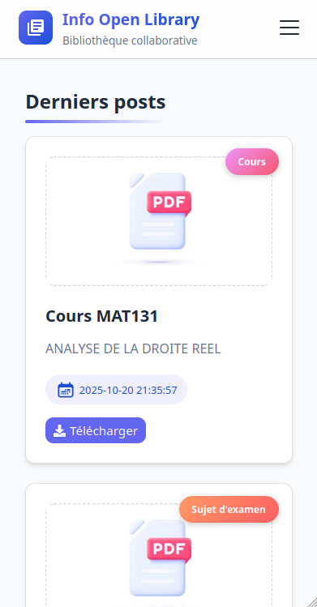

# 📚 OpenLibrary

OpenLibrary est une application web qui permet de gérer une bibliothèque en ligne.  
Le projet est divisé en deux parties :

- **Backend (PHP/MySQL)** — gère les données et l'API.
- **Frontend (React ou autre framework)** — gère l'interface utilisateur.

---

## ⚙️ Prérequis

Avant d'exécuter le projet, assurez-vous d'avoir :

- **XAMPP** (ou WAMP/LAMP) installé
- **PHP 8+**
- **MySQL/MariaDB**
- **Node.js + npm** ou **yarn**
- **Git** (optionnel, mais recommandé)

---

## 🧠 Fonctionnement général

1. Le **backend PHP** communique avec la **base de données MySQL**.
2. Le **frontend** interagit avec le backend via des **requêtes HTTP** (`fetch`).
3. L'utilisateur peut télécharger et ajouter des ressources.

## 🖼️ Aperçu du projet

Voici un aperçu visuel de **OpenLibrary** sur différents appareils :

<div align="center" style="display: flex; flex-wrap: wrap; justify-content: center; gap: 10px;">

<div style="flex: 1 1 250px; max-width: 300px; text-align: center;">

<p>💻 <b>Desktop</b></p>
</div>

<!-- <div style="flex: 1 1 250px; max-width: 300px; text-align: center;">

<p>📗 <b>Tablette</b></p>
</div>

<div style="flex: 1 1 250px; max-width: 300px; text-align: center;">

<p>📱 <b>Mobile</b></p>
</div> -->

</div>

---

## 🖥️ Installation et exécution

### 1️⃣ Cloner le projet

```bash
git clone https://github.com/eren-the-coder/uy1_open_library.git
cd uy1_open_library
```

---

### 2️⃣ Configuration du backend

#### ➤ Étape 1 : Créer le lien symbolique vers `htdocs`

**Sous Linux :**

```bash
sudo ln -s /chemin/vers/openlibrary/backend /opt/lampp/htdocs/openlibrary
```

**Sous Windows :**

- Copiez le dossier `backend/` dans `C:\xampp\htdocs\openlibrary`

#### ➤ Étape 2 : Configuration de la base de données

1. Démarrez **Apache** et **MySQL** via le panneau de contrôle XAMPP

   **Sous Windows :**
   Ouvrez le **panneau de contrôle XAMPP**, puis cliquez sur **Start** à côté de **Apache** et **MySQL**.

   **Sous Linux :**
   Ouvrez un terminal et exécutez les commandes suivantes :

   ```bash
   # Si XAMPP est installé dans /opt/lampp
   sudo /opt/lampp/lampp start
   # Si votre installation de XAMPP est ailleurs, adaptez le chemin :
   # exemple : sudo /usr/lampp/lampp start
   ```

   Cela démarre **Apache**, **MySQL** et **ProFTPD** simultanément.

   Pour vérifier que tout fonctionne :

   ```bash
   sudo /opt/lampp/lampp status
   ```

   Tu devrais voir :

   ```
   Apache is running.
   MySQL is running.
   ```

   Pour arrêter les services :

   ```bash
   sudo /opt/lampp/lampp stop
   ```

2. Ouvrez [phpMyAdmin](http://localhost/phpmyadmin).
3. Importez le fichier :

   ```
   database/openlibrary.sql
   ```

4. Dans `backend/api/config.php`, configurez vos identifiants de connexion à phpMyAdmin :

   ```php
   <?php
   $host = "localhost";
   $user = "root";
   $pass = "";
   $dbname = "openlibrary";

   // ...
   ?>
   ```

#### ➤ Étape 3 : Tester le backend

Ouvrez [http://localhost/openlibrary](http://localhost/openlibrary) ou directement un endpoint API, par exemple :

```
http://localhost/openlibrary/api/getPosts.php
```

---

### 3️⃣ Configuration du frontend

Tapez les commandes suivantes pour démarrer le serveur de développement du **frontend React** :

```bash
cd frontend
npm install
npm run dev
```

Le projet devrait se lancer sur :  
👉 [http://localhost:3000](http://localhost:3000)

---

## 🌐 Déploiement sur un hébergeur

1. **Construisez votre frontend React pour la production :**

   ```bash
   cd frontend
   npm run build
   ```

   Cela crée un dossier `dist/` (ou `build/` selon ta configuration) contenant la version optimisée de ton application React.

2. **Intégrez le backend PHP dans le dossier de production :**

   - Copiez **tout le contenu du dossier `backend/`** dans le dossier `dist/` généré par React :

     ```bash
     cp -r ../backend/* ./dist/
     ```

   **Exemple de structure finale :**

   ```
   dist/
   ├── api/
   ├── index.html
   ├── assets/
   ├── favicon.ico
   ├── .htaccess
   └── ...
   ```

3. **Configurez la base de données distante :**

   - Importez le fichier `openlibrary.sql` sur ta base distante
   - Mets à jour les identifiants dans `dist/api/config.php` :

     ```php
     <?php
     $host = "<host_link>";
     $user = "<user_name>";
     $pass = "<password>";
     $dbname = "openlibrary";
     ?>
     ```

4. **Modifiez le fichier `.htaccess` dans le dossier `dist/`**

   Ce fichier permet :

   - à React de gérer correctement les routes
   - de gérer les erreurs 404 côté client
   - de protéger les fichiers et dossiers sensibles

   Crée un fichier `.htaccess` dans `dist/` avec le contenu suivant :

   ```apache
   # Active le moteur de réécriture
   RewriteEngine On

   # Redirige toutes les requêtes vers index.html sauf celles qui correspondent à un fichier ou dossier existant
   RewriteCond %{REQUEST_FILENAME} !-f
   RewriteCond %{REQUEST_FILENAME} !-d
   RewriteRule ^ index.html [L]

   # Empêche l'accès direct aux fichiers sensibles
   <FilesMatch "\.(env|sql|log|ini|sh|bat)$">
     Order allow,deny
     Deny from all
   </FilesMatch>

   # Empêche l'accès direct au dossier includes
   RewriteRule ^includes/ - [F,L]
   ```

5. **Uploadez le dossier `dist/` sur ton hébergeur web** (par FTP ou via le gestionnaire de fichiers de ton hébergeur).

   - Connectez-vous à votre compte (FTP ou gestionnaire de fichiers).
   - Supprimez les fichiers par défaut de l'hébergeur.
   - Uploadez tout le contenu du dossier `dist/` à la racine de votre hébergement (`/htdocs` ou `/public_html` selon le cas).

6. **Accédez à ton site en ligne** depuis ton nom de domaine ou l'URL fournie par l'hébergeur.

   **Exemple :**

   ```
   https://ton-site.com
   ```

---

## 🧰 Structure de l’API

Chaque fichier dans `backend/api/` représente une route :

- `getPosts.php` → renvoie la liste des ressources
- `addPost.php` → ajoute un livre (POST)
- `getTeachingUnit.php` → renvoie la liste des Unités d'enseignement
- `download.php` → Télécharge une ressource

---

## 👨‍💻 Auteur

**Projet OpenLibrary**  
Développé par _Eren MM_  
Version : `1.0.0`

---

## ⚖️ Licence

Ce projet est libre sous licence MIT.  
Vous pouvez l'utiliser, le modifier et le redistribuer librement, à condition de conserver les mentions d'origine.

---
💡 *Merci d’utiliser OpenLibrary — un projet conçu pour rendre le savoir accessible à tous !*
